# RecSys
An end-to-end, fully automated recommendation system covering the entire pipeline from data processing to cloud-native serving, providing standardized workflows for training, fine-tuning, deployment, and online serving, integrated with modern MLOps tools.

## System Flow Overview
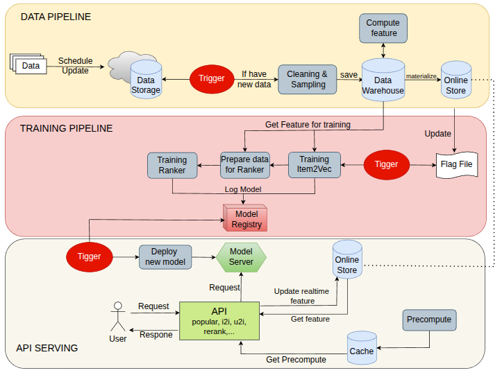  
The system consists of three main workflows: the data pipeline, the training pipeline, and the serving pipeline. New data is updated periodically, and whenever new data is available, the pipelines are automatically triggered to ensure the system continuously captures the latest customer behavior.

### Model:
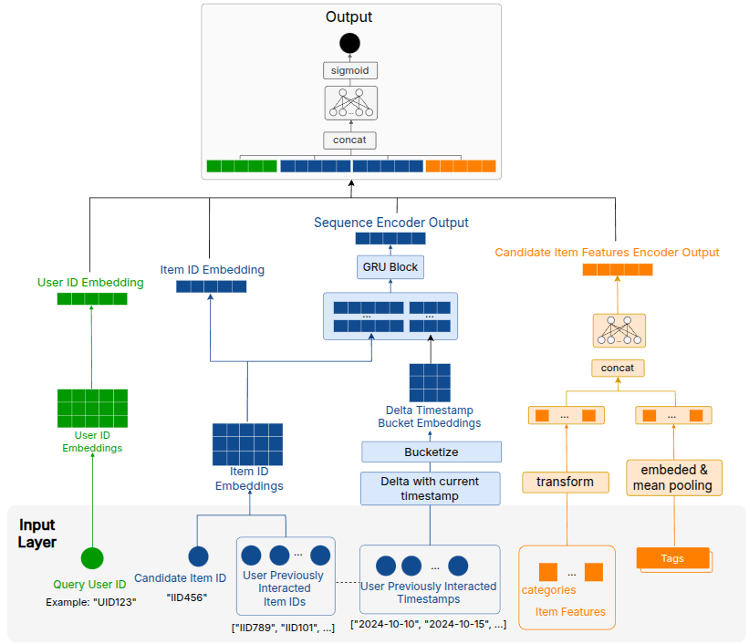  

## Table of Contents
1. [System Flow Overview](#system-flow-overview)
2. [Project Structure](#project-structure)
3. [Implementation](#implementation)
   - [1. Set Up Environment](#1-set-up-environment)
   - [2. Data Pipeline](#2-data-pipeline)
     - [Prepare](#prepare)
     - [Airflow Pipeline](#airflow-pipeline)
   - [3. Training Pipeline](#3-training-pipeline)
     - [Prepare](#prepare-1)
     - [Workload Identity](#workload-identity)
     - [MLflow](#mlflow)
     - [Training Pipeline](#training-pipeline)
   - [4. Serving Pipeline](#4-serving-pipeline)
      - [Deploy Components](#deploy-components) 
      - [Continuous Deployment with Jenkins](#continuous-deployment-with-jenkins)
   - [5. Observability](#5-observability)
## Project Structure
```bash
├── airflow-dags                              // Airflow Data pipeline
│   ├── airflow                               // airflow chart
│   ├── dags                                  // dags to run pipeline
├── api                                       // FastAPI with nginx ingress
├── ContinuousDeployment                      // Copy to VM and Deploy Jenkins to trigger new model
├── feature_pipeline                          // compute feature with DBT and run Feature Store local.
│   ├── dbt                                   // dbt with BigQuery to compute feature
│   ├── feature_store                         // feature store with BigQuery and Redis(GCP CLoudMemory)
│   └── src                                   // source code upload data to BigQuery
├── iac_gke                                   // terraform file to create k8s cluster
├── images                                    // images
├── mlflow                                    // mlflow folder copy to VM and create Mlflow with GCS and CloudSQL
├── model_server                              // BentoML Model Server with Kserver and rollout traffic model 
├── observability                             // LGTM stack with Alloy
├── qdrant                                    // vector store
├── scripts                              
│   └── check_oltp_max_timestamp.py           // check max time stamp to materialize feast
├── src                                       // source code developed and tested locally during project development
├── training_pipeline                         // training pipeline with kubeflow
│   ├── finetuning.ipynb                      // finetune small language model to tagging item
│   ├── pipeline                              // kubeflow pipeline with pytorchjob
│   ├── pipelines                             // src to install kubeflow
│   ├── src                                   // source code to build pipeline component.
├── ui                                        // gradio ui
```

## Implementation
### 1. Set Up Environment
Clone this repository
Set up Python Environment:
```bash
pip install uv==0.8.13
uv sync --all-groups
```
Set up Cloud(GCP):
- Create 1 Vm and 1 Cluster
- Create a Service Account or use Default Service Account
- Add Roles to Service Account: BigQuery Admin, Cloud SQL Admin, Kubernetes Engine Admin, Service Account Admin, Service Account User, Storage Admin(can be replaced with more restrictive roles for better security)
- Dowload Service Account Key (Json)

### 2. Data Pipeline
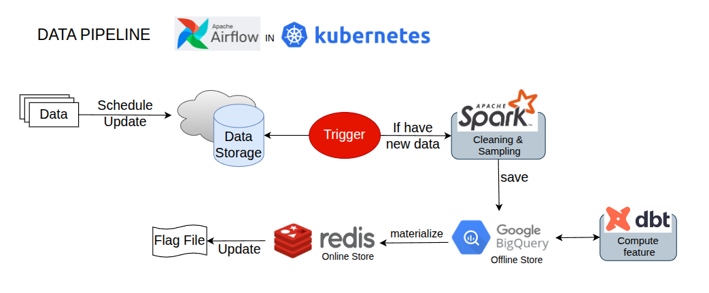  
#### Prepare
Create Secret from service account:
```bash
kubectl create secret generic gcp-sa-secret \
  --from-file=gcp-key.json=path/to/key.json
```

Create namespace: `kubectl create ns serving` (all components are deployed here for simplicity, although separate namespaces can be used)

Create Data Bucket(in my project: `kltn--data`)  
- Data is updated on a scheduled basis using partitioned storage. Files follow the naming convention: `recsys_data_upto_YYYY_MM_DD.parquet`.

Create a Feature Store registry bucket (in my project: `feast-data`) and create the `registry.db` file inside this bucket.

Create a Redis instance (GCP Memorystore) and obtain the connection details.

Create a BigQuery dataset named `kltn` and three table named `traindatareviewtest` within this dataset.

#### Airflow Pipeline
Install Airflow:
- `cd airflow-dags` 
- Update the repo value in dags.gitSync to point to your repository in the Airflow values file.
- `helm install airlow ./airflow`
- `kubectl apply -f createpod_role.yaml`
- `kubectl apply -f addrole_svacc.yaml`

Dags:
- Update the `project_id` value in the dbt profiles.
- Update the `project_id` and `connection_string` (Redis IP) in `feature_store.yaml`.
- Build the Docker image from `airflow_all_in_one.Dockerfile` and push it to Docker Hub.
- Update the IMAGE name and Kubernetes IP in `dags/data_pipeline.py`, then push the changes to GitHub.

Access Airflow:
- `kubectl port-forward svc/airflow-web 8080:8080` -n serving
- access `localhost:8080`
- Go to Admin -> Connection -> Add connection: name is `google_cloud_default`, type Google Cloud, Copy file Service Account Key Json and Paste into 

You can now run the data pipeline by triggering the DAGs.  
However, during the first run, the pipeline is expected to fail at the Feature Store step because it has not been initialized yet.

Apply feast:
- GCP Memorystore (Redis) is only accessible within the internal VPC, so an SSH tunnel is used for access.  
- SSH into the VM created above using an SSH key.  
- ssh into redis: `gcloud compute ssh vm-name -- -L 6379:<PRIVATE_IP_OF_REDIS>:6379`.  
```bash
cd $ROOT_DIR && MATERIALIZE_CHECKPOINT_TIME=$(uv run scripts/check_oltp_max_timestamp.py 2>&1 | awk -F'<ts>|</ts>' '{print $2}')
cd feature pipeline/feature_store/feature_repo
change RedisIP to `localhost`
uv run feast apply
uv run feast materialize-incremental $MATERIALIZE_CHECKPOINT_TIME -v parent_asin_rating_stats -v parent_asin_rating_stats_fresh -v user_rating_stats -v user_rating_stats_fresh
```

Finally, re-run the Airflow pipeline.  
  
### 3. Training Pipeline
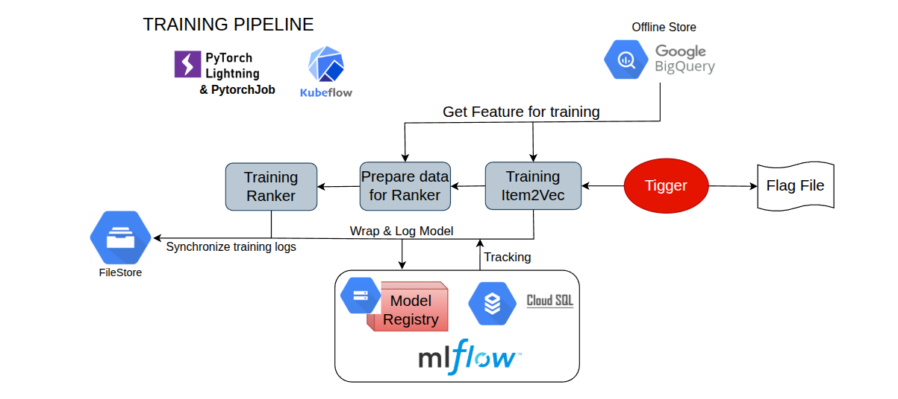  
#### Prepare 
Install Kubeflow:
```bash
cd training_pipeline/pipelines

kubectl apply -k manifests/kustomize/cluster-scoped-resources
kubectl apply -k manifests/kustomize/env/platform-agnostic
kubectl apply -k "github.com/kubeflow/training-operator/manifests/overlays/standalone?ref=v1.7.0"

kubectl patch deployment seaweedfs -n kubeflow -p '{
  "spec": {
    "template": {
      "spec": {
        "securityContext": {
          "fsGroup": 2000,
          "runAsUser": 1000
        }
      }
    }
  }
}'

kubectl rollout status deployment/seaweedfs -n kubeflow
```

Create a GCP Filestore instance for distributed training, providing a shared filesystem that can be accessed concurrently by multiple pods.  
- Go to Filestore GCP and create `BASIC_HDD 1TB`.
- Update nfs path to the Filestore Address and `kubectl apply -f training_pvc.yaml`

#### Workload Identity
```bash
gcloud iam service-accounts add-iam-policy-binding \
    yourserviceaccount@YOUR_PROJECT_ID.iam.gserviceaccount.com \
    --role roles/iam.workloadIdentityUser \
    --member "serviceAccount:YOUR_PROJECT_ID.svc.id.goog[kubeflow/pipeline-runner]"

kubectl annotate serviceaccount pipeline-runner \
    -n kubeflow \
    iam.gke.io/gcp-service-account=yourserviceaccount@YOUR_PROJECT_ID.iam.gserviceaccount.com

kubectl apply -f pytorchjob-rbac.yaml`
```
pipeline-runner is the service account used to run component in pipeline.

#### MLflow

- Create a Cloud SQL (PostgreSQL) instance as the backend store.
  - Enable **Private IP**.
  - Create a database and user for MLflow.

- Create a GCS bucket to be used as the artifact store.

- SSH into the VM and copy the `mlflow` directory to the VM.

- Build the `mlflow-server` Docker image from the MLflow Dockerfile.

- Set the `BACKEND_STORE_URI` and `ARTIFACTS_DESTINATION` environment variables.

- Run the MLflow server:
  ```bash
  docker run -d \
    -p 8080:8080 \
    -e BACKEND_STORE_URI="$BACKEND_STORE_URI" \
    -e ARTIFACTS_DESTINATION="$ARTIFACTS_DESTINATION" \
    -e MLFLOW_SERVER_ALLOWED_HOSTS="*" \
    --name mlflow \
    mlflow-server

- Open firewall to access

#### Training Pipeline

- Fine-tune `Qwen3-0.6B` for item tagging using the `finetuning.ipynb` notebook (executed on Kaggle), then compute tag embeddings for use in model training.
- Update the configuration values in `src/feature_repo` to match your project setup.
- Build the training Docker image from the provided Dockerfile and push it to Docker Hub.
- Navigate to the pipeline directory:
  `cd pipeline`

- Update the following fields in `_ptjob.yaml`:
  - serviceAccount
  - image
  - mlflow_uri
  Upload the updated `_ptjob.yaml` file to GCS.

- Generate the Kubeflow pipeline definition:
  `python training_pipeline.py`
  This command generates the `training_pipeline.yaml` file.

- Access the Kubeflow Pipelines UI:
  kubectl port-forward svc/ml-pipeline-ui 8080:8080 -n serving

- Create a pipeline using the `training_pipeline.yaml` file.
- Create a run from the pipeline to start the training workflow.

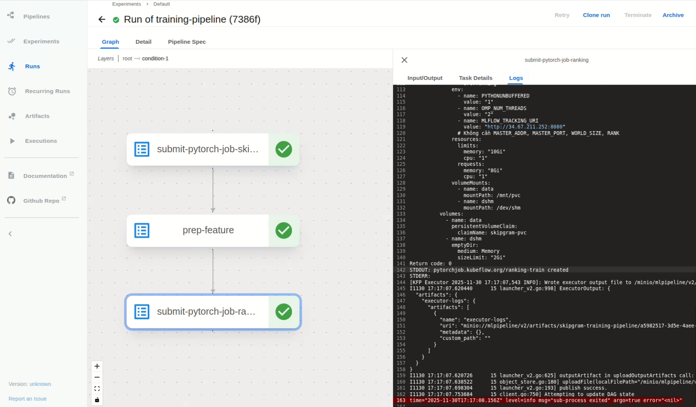  


### 4. Serving Pipeline
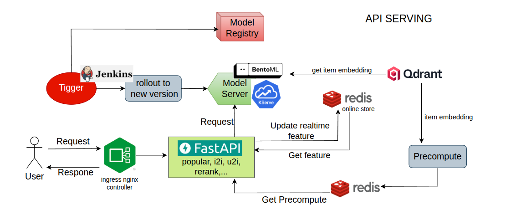   
#### Deploy Components:
```bash
helm install qdrant ./qdrant
cd feature_pipeline/feature_store
Build image from docker file and upload to DockerHub
kubectl apply -f feature-online-server.yaml

cd model_server
Build image from docker file and upload to DockerHub
cd istio-*
export PATH=$PWD/bin:$PATH
istioctl install --set profile=default -y
kubectl label namespace serving istio-injection=enabled
kubectl apply -f ranker-inferenceservice.yaml

cd api
Build image from docker file and upload to DockerHub
kubectl create namespace ingress-nginx   
helm install nginx-ingress ./ingress-nginx \
  --namespace ingress-nginx \
  --set controller.publishService.enabled=true
kubectl apply -f api-deployment.yaml
kubectl apply -f api-ingress.yaml

cd feature_pipeline/feature_store
kubectl apply -f feast_ingress.yaml
```

Precompute:
cd src/precompute.
Port-forward Qdrant, SSH tunel Redis and change path in python files.
```bash
uv run load_to_vector_store.py
uv run embedding_tag.py
uv run batch_precompute.py
uv run store_user_inter_seq.py
uv run upload_item_metadata.py
```

UI:
```bash
ssh into VM
copy folder `ui`
sudo vim /etc/hosts: insert `<Ingress Controller IP>  kltn.recsys.com` and `<Ingress Controller IP>  feast.kltn.com`
run file `gradio_ui.py`
```

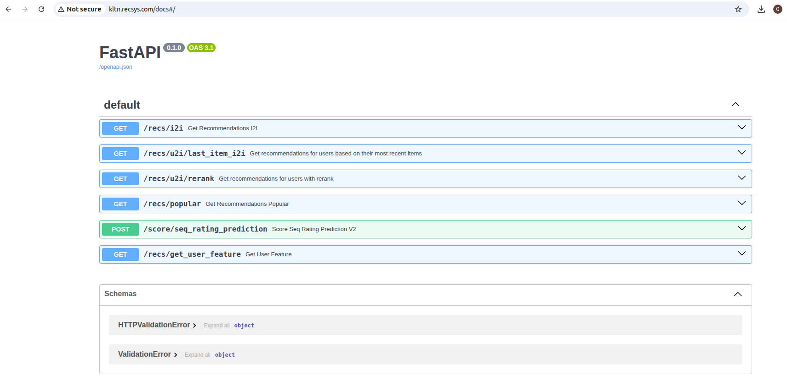  
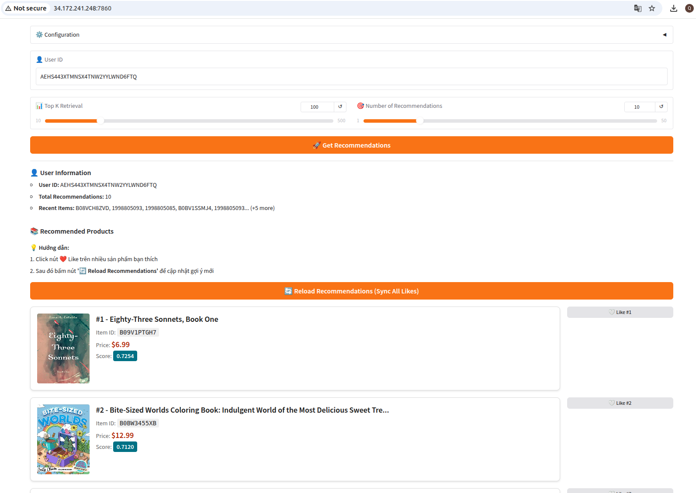  


#### Continuous Deployment with Jenkins
Jenkins triggers MLflow to perform a rolling deployment of the latest model.

SSH in to VM and copy folder ContinuousDeployment to VM.

Install Jenkins:
```bash
docker pull jenkins/jenkins:lts
docker run -d \
  --name jenkins \
  -p 8000:8080 \
  -p 50000:50000 \
  -v jenkins_home:/var/jenkins_home \
  jenkins/jenkins:lts
```

Install `kubectl` in VM  
Install `gke-gcloud-auth-plugin`  
Copy file .kube/config to VM

Now, VM can access K8s Cluster.

Setup Jenkins:
- Open firewall and access Jenkins Web.
- Create a Node connect to VM to run flow: `Manage Jenkins -> Nodes -> New Node -> Name: host-agent -> Launch method via SSH -> Host: VM IP -> Add credentials: User name with Private Key -> Add private key(should RSA Format) -> None Verification Strategy -> Save`
- Create Pipeline, Copy Jenkins file.

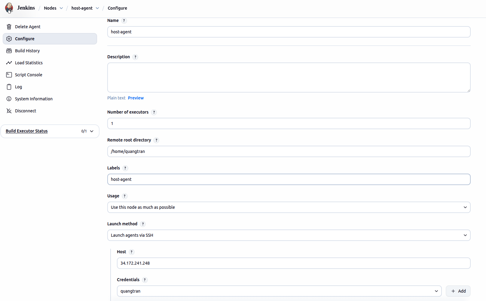  


Jenkins triggers traffic rollout to the new model version.  

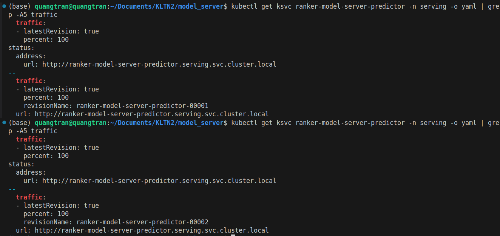  
### 5. Observability
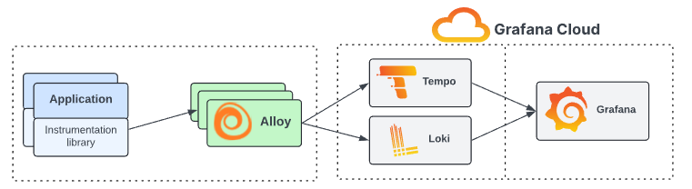  

Use LGTM Stack

Create 3 GCS bucket: `kltn-loki-data` , `kltn-mimir-data`, `kltn-tempo-data`

Install:
```bash
kubectl create ns lgtm
kubens lgtm
kubectl create serviceaccount lgtm-ksa

gcloud iam service-accounts add-iam-policy-binding \
    yourserviceaccount@YOUR_PROJECT_ID.iam.gserviceaccount.com \
    --role roles/iam.workloadIdentityUser \
    --member "serviceAccount:YOUR_PROJECT_ID.svc.id.goog[lgtm/lgtm-ksa]"

kubectl annotate serviceaccount lgtm-ksa \
    -n lgtm \
    iam.gke.io/gcp-service-account=yourserviceaccount@YOUR_PROJECT_ID.iam.gserviceaccount.com


cd observability
helm install loki ./loki
helm install mimir ./mimir-distributed
helm install tempo ./tempo
helm install grafana ./grafana
helm install alloy ./alloy
```

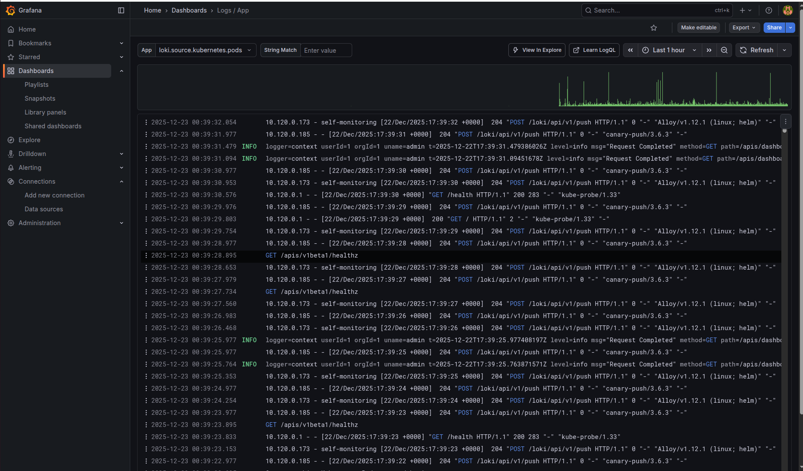  


- Port-forward the Grafana service to access the Grafana UI.
- Create dashboards to visualize system and pipeline metrics.
